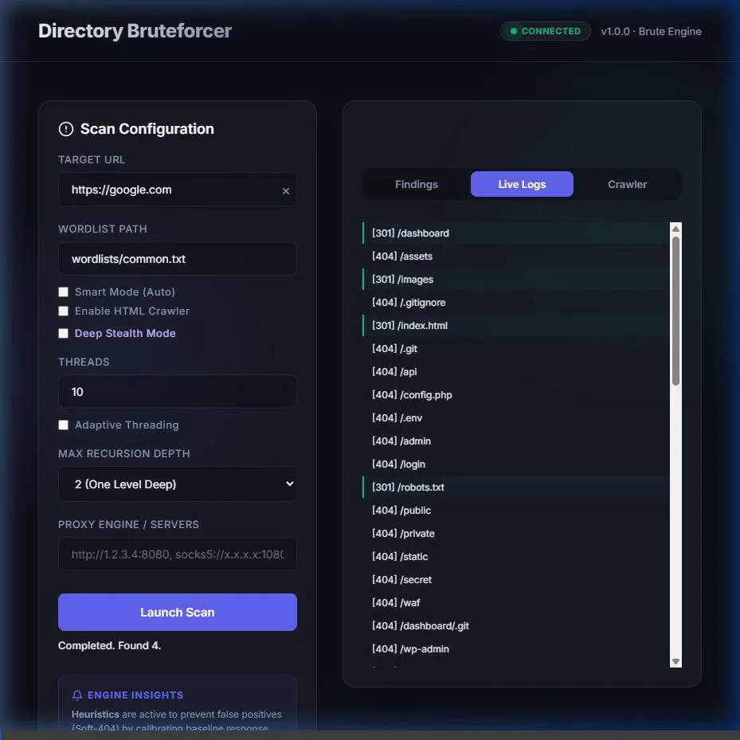
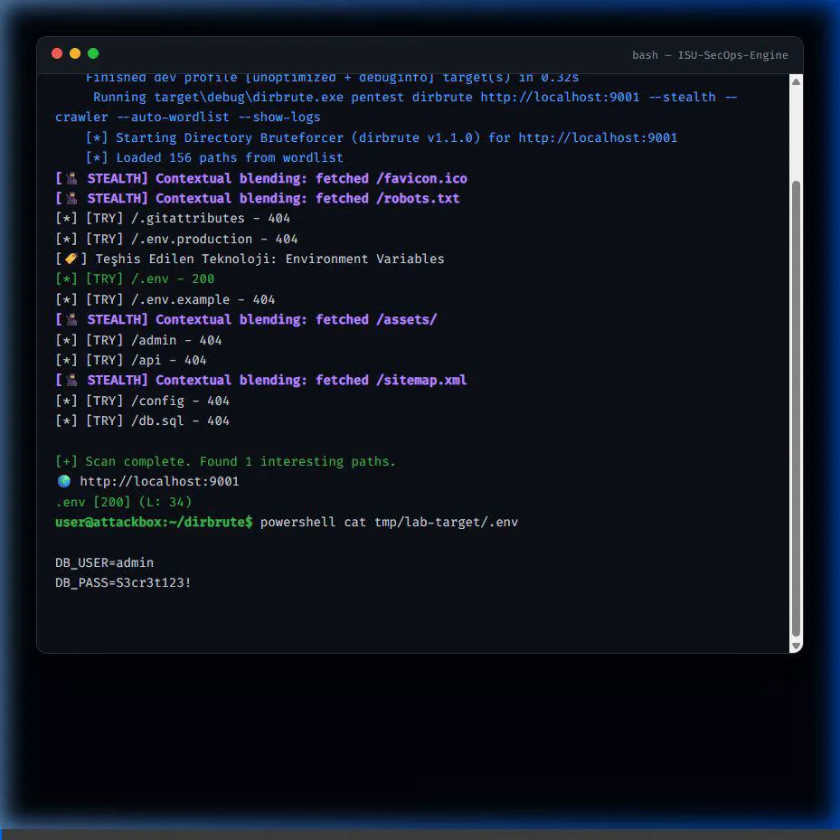

# 🛸 ISU-SecOps-Engine (dirbrute v1.1.0)

<div align="center">
  
  <br>
  <h1>İstinye Üniversitesi - Bilişim Güvenliği Teknolojileri</h1>
  <h3>Academic Supervisor: Öğr. Gör. Keyvan Arasteh Abbasabad</h3>
  <br>
  
  
  
  
  <br>
  
  
  
  
</div>

---

## 📑 İçindekiler
- [📖 Giriş](#-giriş)
- [💎 Temel Modüller ve Özellikler](#-temel-modüller-ve-özellikler)
- [🎬 Demo](#-demo)
- [🚀 Hızlı Başlama](#-hızlı-başlama)
- [📊 CLI Parametre Referansı](#-cli-parametre-referansı)
- [🏗️ Teknoloji Stack & Geliştirici Ekosistemi](#-teknoloji-stack--geliştirici-ekosistemi)
- [📜 Lisans & Sorumluluk Reddi](#-lisans--sorumluluk-reddi)

---

### 📖 Giriş

**ISU-SecOps-Engine (dirbrute)**, modern sızma testleri ve güvenlik denetimleri için Rust ile geliştirilmiş, ultra hızlı ve düşük izli (low-footprint) bir keşif motorudur. **İstinye Üniversitesi Güvenlik Operasyonları** kapsamında geliştirilen bu araç, standart tarayıcıların ötesine geçerek **Deep Stealth** ve **Rotating Proxy** teknolojileriyle en katı güvenlik duvarlarını (WAF) profesyonel bir hassasiyetle aşmanıza olanak tanır.

---

### 💎 Temel Modüller ve Özellikler

#### 🥷 1. Deep Stealth & WAF Evasion
- **Contextual Blending**: Tarama trafiği arasına `/robots.txt`, `/favicon.ico`, `/assets/logo.png` gibi zararsız "decoy" istekler serpiştirir.
- **Autonomous Cooldown**: WAF kısıtlaması (403/429) algılandığında otonom uyutma ve soğuma periyodu başlatır.
- **Jitter & UA Rotation**: Mikro-gecikmeler ve binlerce gerçek "User-Agent" arasında rotasyon.

#### 🔄 2. Rotating Proxy Pool
- **Proxy Rotation**: Virgülle ayrılmış çoklu HTTP/SOCKS5 proxy havuzu desteği.
- **Random Selection**: Her worker her istekte havuzdan rastgele bir kimlik (IP) seçer.

#### 🛰️ 3. Dynamic HTML Crawler
- Gerçek zamanlı JS/CSS ve HTML ayrıştırması yaparak içeride gizli URL'leri keşfeder ve tarama kuyruğuna ekler.

#### 🧠 4. Smart Content Discovery
- **Technology Fingerprinting**: WordPress, Laravel, Docker, Django tespiti ve hedef odaklı tarama.
- **Heuristic 404 Filter**: "Soft-404" durumlarında baseline analizi ile yanlış pozitiflerin elenmesi.

---

### 🎬 Demo

Aracın hem Web arayüzü hem de Terminal (CLI) üzerinden kullanım demolarını aşağıdan izleyebilirsiniz:

#### 🌐 Web Interface (Glassmorphism & Real-time)


#### 💻 Terminal Interface (High-Performance CLI)


---

### 🚀 Hızlı Başlama

#### 🛠️ Kurulum
```bash
git clone https://github.com/RedRiveRR/ISU-SecOps-Engine
cd ISU-SecOps-Engine
cargo build --release
```

#### 🌐 Web Kontrol Paneli (Web UI)
```bash
cargo run --release -- web --port 8080
```

#### 💻 CLI - Gelişmiş Kullanım
```bash
# Akıllı ve Hayalet Mod kombinasyonu
cargo run --release -- pentest dirbrute "http://target.com" --stealth --crawler --auto-wordlist
```

---

### 📊 CLI Parametre Referansı

| Parametre | Kısa | Açıklama |
| :--- | :--- | :--- |
| `url` | - | Hedef URL (Zorunlu) |
| `--wordlist` | `-w` | Özel kelime listesi yolu |
| `--auto-threads` | - | Otomatik hız ayarlama (Adaptive) |
| `--threads` | `-t` | Maksimum eşzamanlı istek (Varsayılan: 10) |
| `--stealth` | `-s` | **Deep Stealth** modunu aktif eder |
| `--crawler` | `-C` | HTML Crawler motorunu açar |

---

### 🏗️ Teknoloji Stack & Geliştirici Ekosistemi

<div align="center">
  
  
  
  
</div>

Proje geliştiriciler için tam otomatize edilmiştir:
- **`Justfile`**: `just ci` komutuyla CI/CD görevlerini yerel olarak çalıştırın.
- **`.github/workflows`**: Otomatik GitHub Actions CI entegrasyonu.
- **`.gitattributes`**: Line ending ve professional file handling standardı.

---

### 📜 Lisans & Sorumluluk Reddi

Bu proje **MIT Lisansı** ile lisanslanmıştır. Araç yalnızca yasal penetrasyon testleri ve eğitim amaçlı tasarlanmıştır. İzinsiz kullanımda tüm sorumluluk kullanıcıya aittir.

**Geliştiren:** [Mert Kızılırmak (RedRiveRR)](https://github.com/RedRiveRR)  
**Akademik Yönetim:** İstinye Üniversitesi - Öğr. Gör. Keyvan Arasteh Abbasabad

---
<div align="center">
  <sub>İstinye Üniversitesi için ❤️ ve 🦀 ile üretilmiştir.</sub>
</div>
